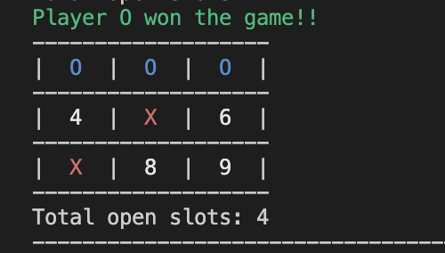

# Tic Tac Toe Game

This is a simple implementation of the classic Tic Tac Toe game in Rust. The game allows two players to play against each other and displays the game board in the terminal.



## Features

- Two-player mode (Human vs. Human)
- Option to play against a computer with adjustable difficulty levels
- Display the game board in the terminal.
- Follows standard Tic Tac Toe rules for winning and tying conditions.
- Supports both 'X' and 'O' players.

## Getting Started

1. Clone the repository
   
2. Build and run the game:
   ```bash
   cargo build
   cargo run
   ```

## Usage

- The game board is displayed in the terminal, with each cell numbered from 1 to 9.
- Players take turns to input their moves by selecting a cell number.
- The game continues until one player wins or the game ends in a tie.

## Acknowledgements
- Colored crate for terminal text coloring.